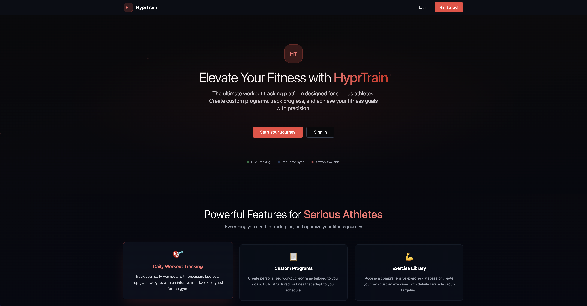
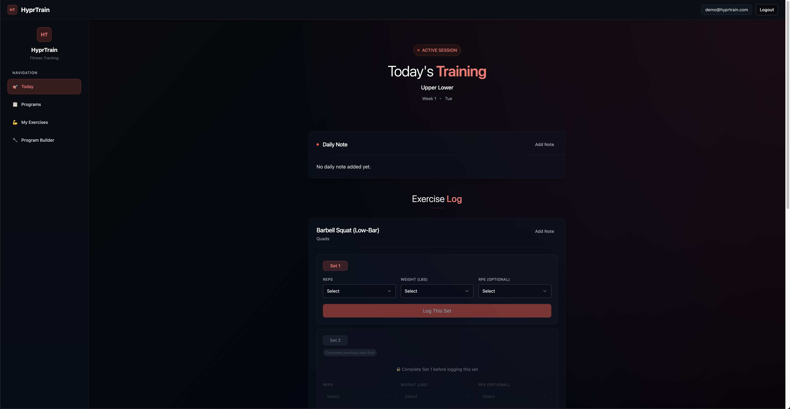
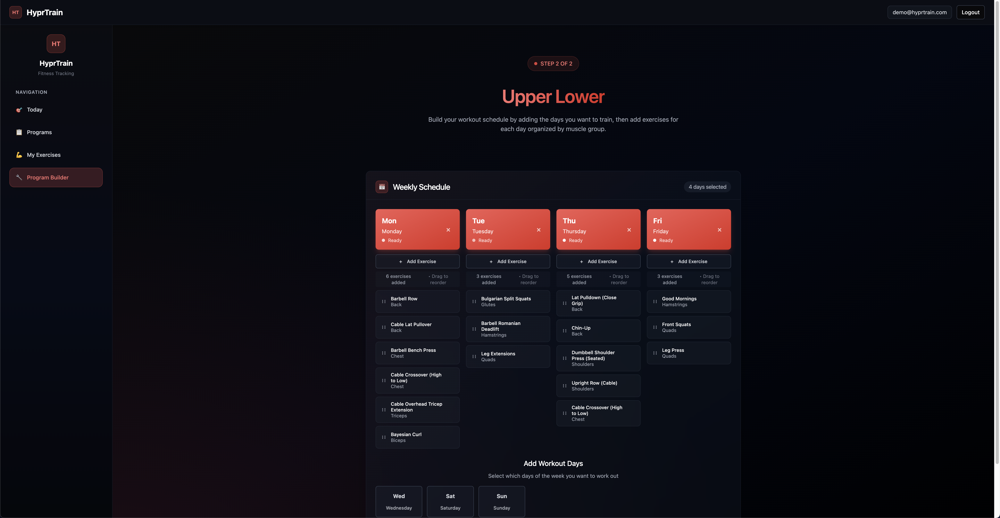
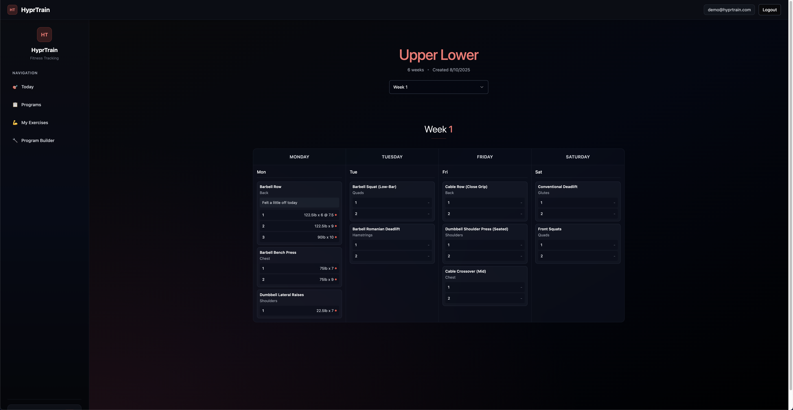

# HyprTrain
**Full-stack, mobile-first workout tracking app** built with **TypeScript, Node.js, Express, PostgreSQL, React (Vite), Tailwind CSS, and Docker**.  
Features JWT authentication, a three-layer backend architecture (controller → service → model), a normalized relational database schema, and containerized deployment.  

---

## Overview
HyprTrain is designed for serious lifters and athletes who want **complete control over their training**.  
It allows users to:  
- Create **custom 4–16 week programs**.  
- Add workouts for specific days of the week.  
- Select exercises by muscle group (default + user-defined).  
- Log **weight, reps, and optional RPE** for each set.  
- Track soreness and add per-day and per-exercise notes.  
- Auto-propagate workout changes to future weeks.  
- View previous performance for progressive overload.  

This project demonstrates **end-to-end engineering skills**: backend API design, relational database modeling, responsive frontend UI, and production-ready deployment.

---

## Live Demo
[Try HyprTrain here](https://hyprtrain.vercel.app/)  

**Demo Account** (no signup required):  
- **Email**: `demo@hyprtrain.com`  
- **Password**: `DemoPass@123`  

---

## Screenshots

> Store your images in `client/public/screenshots/...` so GitHub can display them via relative paths.

### Mobile Views
| Feature | Screenshot |
|---|---|
| Mobile Workout Logger |  |
| Mobile Program Builder |  |

---

### Desktop Views
| Feature | Screenshot |
|---|---|
| Desktop Landing Page |  |
| Desktop Workout Logger |  |
| Desktop Program Builder |  |
| Desktop Program Overview |  |

---

## Demo Video / GIFs

[](https://youtu.be/WwzjcYmljvU)

- **Full App Walkthrough (Video)** – [Watch on YouTube](https://youtu.be/WwzjcYmljvU)  

---

## Project Structure

```
hyprtrain/
├── client/                  # Frontend (React + Vite + Tailwind CSS)
│   ├── public/
│   │   ├── screenshots/
│   │   │   ├── mobile/
│   │   │   │   ├── workout-logger.png
│   │   │   │   ├── program-builder.png
│   │   │   │   └── custom-exercise.png
│   │   │   └── desktop/
│   │   │       ├── workout-logger.png
│   │   │       ├── program-builder.png
│   │   │       └── custom-exercise.png
│   │   ├── gifs/
│   │   │   ├── program-creation.gif
│   │   │   └── workout-logging.gif
│   │   └── videos/
│   │       └── full-walkthrough.mp4
│   └── src/
│       ├── api/
│       ├── assets/
│       ├── components/
│       ├── context/
│       ├── layouts/
│       ├── lib/
│       ├── pages/
│       ├── routes/
│       ├── App.css
│       ├── App.tsx
│       ├── index.css
│       ├── main.tsx
│       └── vite-env.d.ts
│   ├── .env.example
│   ├── index.html
│   ├── package.json
│   ├── tailwind.config.js
│   └── tsconfig.json
│
├── server/                  # Backend (TypeScript + Express + PostgreSQL)
│   ├── docs/
│   │   └── API.md
│   └── src/
│       ├── controllers/
│       ├── db/
│       ├── middleware/
│       ├── models/
│       ├── routes/
│       ├── services/
│       ├── types/
│       ├── utils/
│       ├── validation.ts
│       ├── app.ts
│       └── server.ts
│   ├── .env.example
│   ├── Dockerfile
│   ├── package.json
│   └── tsconfig.json
│
├── docker-compose.yml
└── README.md
```

---

## API Documentation
Full API docs are available in [`server/docs/API.md`](server/docs/API.md).

---

## Setup & Installation

**Prerequisites**  
- Node.js (v18+)  
- Docker & Docker Compose  

**Steps**  
```bash
# Clone the repo
git clone https://github.com/yourusername/hyprtrain.git
cd hyprtrain

# Copy environment variables for backend
cp server/.env.example server/.env

# Copy environment variables for frontend
cp client/.env.example client/.env

# Start services
docker-compose up --build

# Backend: http://localhost:8080
# Frontend: http://localhost:5173
```

---

## Deployment

HyprTrain is deployed with a **three-tier, cloud-hosted architecture**:  

- **Neon (PostgreSQL)** – Serverless, scalable PostgreSQL database with connection pooling for efficient query handling.  
- **Render (Backend)** – Dockerized Express + TypeScript API deployed as a web service, securely connected to Neon via environment variables.  
- **Vercel (Frontend)** – Vite + React app deployed to Vercel’s global CDN, making API calls to the Render backend.  

This setup provides **independent scaling**, **low latency**, and **cost-effective hosting** across all tiers.  
